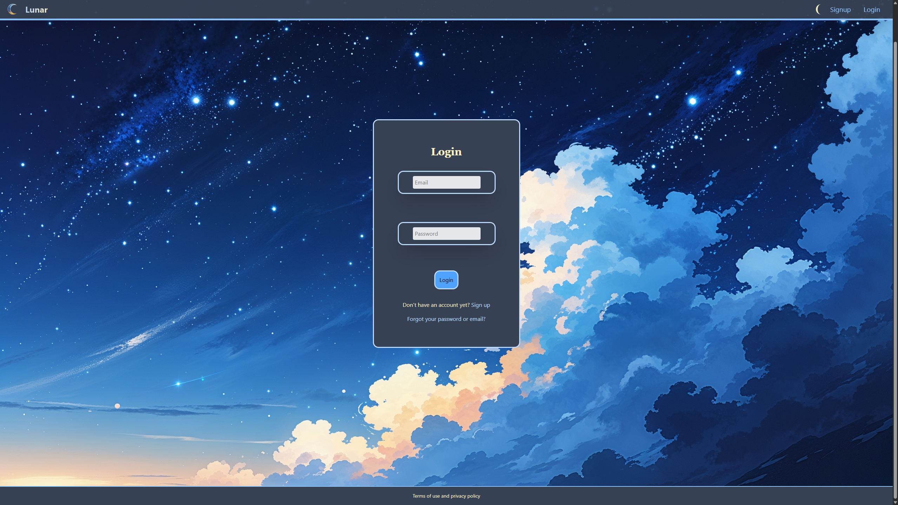
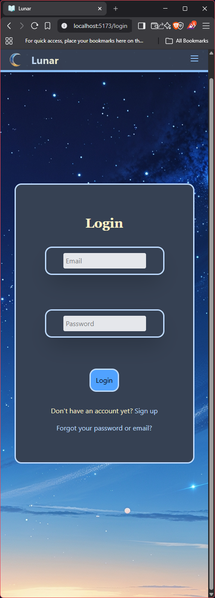

# Lunar - Personal Journaling Application

A modern, secure full-stack web application for personal journaling and reflection. Built with React, Node.js, and MongoDB, Insight provides users with a reactive interface to create, manage, and reflect on their personal journals while maintaining privacy and security, still in super early state.

## ✨ Features

- **🔐 Secure Authentication**: JWT-based authentication with automatic token refresh and secure password hashing
- **📖 Journal Management**: Create, view, and delete personal journals with full CRUD operations
- **📝 Rich Journal Entries**: Write and manage journal entries
- **📊 User Statistics**: Track journaling activity and insights with computed statistics
- **🎨 Modern UI**: Responsive design built with Tailwind CSS and React

- ** Features ** are in a early state and are basic hopefully to be expanded in the future to add images to pages, and further customization to the application
 when I have time between other projects to improve the experience.

## 📸 Screenshots

### Login Interface



### Mobile Login View



## 🔒 Security Features

### Frontend Security

- **Input Sanitization**: All user inputs are sanitized to prevent XSS attacks
- **Form Validation**: Client-side validation with comprehensive error messages
- **Rate Limiting**: Login and signup attempts are rate-limited to prevent brute force
- **Secure Storage**: Sensitive data never stored in localStorage/sessionStorage
- **Clickjacking Protection**: Automatic detection and prevention of iframe-based attacks
- **CSP Headers**: Content Security Policy implementation (backend)
- **Request Interceptors**: Automatic request validation and sanitization
- **Error Sanitization**: Error messages sanitized to prevent information leakage
- **Secure Random Generation**: Cryptographically secure random values for nonces and IDs

### Authentication Security

- **JWT Tokens**: Short-lived access tokens (15 minutes) with automatic refresh
- **HTTP-Only Cookies**: Refresh tokens stored securely in HTTP-only cookies
- **Password Policies**: Strong password requirements with validation
- **Account Lockout**: Rate limiting prevents brute force attacks
- **Secure Logout**: Complete token cleanup on logout

### Data Protection

- **Input Validation**: Comprehensive validation for all user inputs
- **XSS Prevention**: HTML encoding and sanitization of all dynamic content
- **CSRF Protection**: Request headers and origin validation
- **Secure Headers**: Helmet.js provides comprehensive security headers
- **CORS Policy**: Strict cross-origin resource sharing controls

## 🔍 Security Monitoring & Auditing

### Automated Security Checks

- **Dependency Auditing**: Regular security audits of npm packages
- **Vulnerability Scanning**: Automated detection of known security issues
- **Sentry Integration**: Real-time error monitoring and alerting
- **Input Validation**: Comprehensive client and server-side validation

### Security Scripts

```bash
# Run security audit
npm run security-audit

# Check for vulnerabilities
audit-ci --config audit-ci.json
```

### Content Security Policy

CSP is implemented **server-side** via Helmet.js middleware in the backend, providing comprehensive protection against XSS and injection attacks.

### Security Implementation Status

✅ **Active Security Features**: Input sanitization, form validation, rate limiting, secure HTTP interceptors, and dependency auditing are fully implemented and working.

⚠️ **Build Compatibility**: The SecurityInitializer component is temporarily disabled to ensure build compatibility. Security checks are still performed through other implemented measures.

- **📱 Mobile Friendly**: Responsive design that works on all devices
- **⚡ Fast Development**: Vite-powered frontend with hot module replacement
- **🛡️ Error Monitoring**: Sentry integration for production error tracking
- **📧 Account Recovery**: Email-based password reset functionality

## 🛠️ Tech Stack

### Frontend

- **React 19** - Modern React with hooks and concurrent features
- **Vite** - Fast build tool and development server
- **Tailwind CSS** - Utility-first CSS framework
- **React Router** - Client-side routing
- **Axios** - HTTP client for API calls
- **Context API** - State management for authentication and messaging

### Backend

- **Node.js** - JavaScript runtime
- **Express.js** - Web framework for REST API
- **MongoDB** - NoSQL database with Mongoose ODM
- **Passport.js** - Authentication middleware
- **JWT** - JSON Web Tokens for secure authentication
- **bcrypt** - Password hashing
- **Helmet** - Security headers
- **CORS** - Cross-origin resource sharing
- **Express Rate Limit** - API rate limiting

### DevOps & Monitoring

- **Sentry** - Error tracking and monitoring
- **Nodemailer** - Email service for account recovery
- **Multer** - File upload handling
- **Express Mongo Sanitize** - NoSQL injection protection

## 📋 Prerequisites

- **Node.js** 16+ ([Download](https://nodejs.org/))
- **MongoDB** (local installation or [MongoDB Atlas](https://www.mongodb.com/atlas) cloud)
- **npm** (comes with Node.js)
- **Git** for cloning the repository

## Usage

1. **Sign Up**: Create a new account with email and password
2. **Login**: Authenticate with your credentials
3. **Create Journal**: Start your first journal
4. **Write Entries**: Add reflections and thoughts
5. **View Statistics**: Track your journaling activity
6. **Manage Account**: Update profile and security settings

## Documentation

## Quick Start Guide

- **[ Quick Start ](docs/SETUP.md)** if you want to try to run it youself on your machine

## Documentation Resources
- **[Setup Guide](docs/SETUP.md)** - Detailed installation and configuration
- **[API Reference](docs/API.md)** - Complete REST API documentation
- **[Troubleshooting](docs/TROUBLESHOOTING.md)** - Common issues and solutions
- **[Error Handling](docs/ERROR_HANDLING.md)** - Understanding error responses

## Project Structure

```
Insight/
├── client/                    # React frontend
│   ├── src/
│   │   ├── components/       # Reusable React components
│   │   │   ├── account/      # Authentication pages
│   │   │   ├── journal/      # Journal management
│   │   │   ├── layout/       # Navigation & UI components
│   │   │   └── context/      # React context providers
│   │   ├── hooks/            # Custom React hooks
│   │   ├── utils/            # Helper functions
│   │   └── assets/           # Static assets
│   ├── package.json
│   └── vite.config.js
├── server/                    # Express backend
│   ├── routes/               # API route handlers
│   ├── schema/               # MongoDB schemas
│   ├── authentication/       # Passport strategies
│   ├── middleware/           # Express middleware
│   ├── database/            # Database connection
│   ├── utils/               # Server utilities
│   ├── package.json
│   └── server.js
├── docs/                     # Documentation
└── README.md
```

## 🔧 Development

### Available Scripts

#### Frontend

```bash
cd client
npm run dev      # Start development server
npm run build    # Build for production
npm run preview  # Preview production build
npm run lint     # Run ESLint
```

#### Backend

```bash
node --env-file=.env server.js       # Start production server
.env can be the name of your ENV file the ENV file

```

### Testing

Currently, the project focuses on development and learning. Testing frameworks can be added in future iterations.

## ⚠️ Disclaimer

This is a work-in-progress application developed for educational purposes. While it implements security best practices, it may contain bugs and is not recommended for production use without thorough testing and security audits.

## 📞 Support

For questions or issues:

1. Check the [Troubleshooting Guide](docs/TROUBLESHOOTING.md)
2. Review server logs for error details
3. Check browser developer tools for client-side errors

---

_Built for myself for personal growth and reflection_
